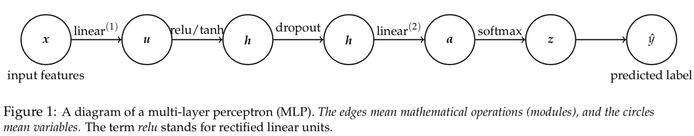
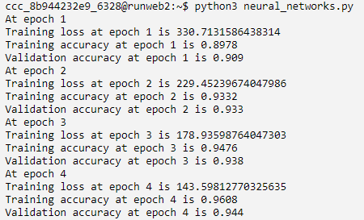

# Neural Nets

## Neural Networks[¶](#Neural-Networks-%2840-points%29)

In this task, you are asked to implement neural networks. You will use this neural network to classify MNIST database of handwritten digits (0-9). The architecture of the neural network you will implement is based on the multi-layer perceptron (MLP, just another term for fully connected feedforward networks we discussed in the lecture), which is shown in Figure 1. It is designed for a K-class classification problem. Let $(x\\in\\mathbb{R}^D, y\\in\\{1,2,\\cdots,K\\})$ be a labeled instance, such an MLP performs the following computations:

$$ \\begin{align} \\textbf{input features}: \\hspace{15pt} &amp; x \\in \\mathbb{R}^D \\\\ \\textbf{linear}^{(1)}: \\hspace{15pt} &amp; u = W^{(1)}x + b^{(1)} \\hspace{2em}, W^{(1)} \\in \\mathbb{R}^{M\\times D} \\text{ and } b^{(1)} \\in \\mathbb{R}^{M} \\label{linear\_forward}\\\\ \\textbf{tanh}:\\hspace{15pt} &amp; h =\\cfrac{2}{1+e^{-2u}}-1 \\label{tanh\_forward}\\\\ \\textbf{relu}: \\hspace{15pt} &amp; h = \\max\\{0, u\\} = \\begin{bmatrix} \\max\\{0, u\_1\\}\\\\ \\vdots \\\\ \\max\\{0, u\_M\\}\\\\ \\end{bmatrix} \\label{relu\_forward}\\\\ \\textbf{linear}^{(2)}: \\hspace{15pt} &amp; a = W^{(2)}h + b^{(2)} \\hspace{2em}, W^{(2)} \\in \\mathbb{R}^{K\\times M} \\text{ and } b^{(2)} \\in \\mathbb{R}^{K} \\label{linear2\_forward}\\\\ \\textbf{softmax}: \\hspace{15pt} &amp; z = \\begin{bmatrix} \\cfrac{e^{a\_1}}{\\sum\_{k} e^{a\_{k}}}\\\\ \\vdots \\\\ \\cfrac{e^{a\_K}}{\\sum\_{k} e^{a\_{k}}} \\\\ \\end{bmatrix}\\\\ \\textbf{predicted label}: \\hspace{15pt} &amp; \\hat{y} = \\mathrm{argmax}\_k z\_k. %&amp; l = -\\sum\_{k} y\_{k}\\log{\\hat{y\_{k}}} \\hspace{2em}, \\vy \\in \\mathbb{R}^{k} \\text{ and } y\_k=1 \\text{ if } \\vx \\text{ belongs to the } k' \\text{-th class}. \\end{align} $$

### Q1. Linear Layer[¶](#Q1.-Linear-Layer-%2815-points%29)

First, you need to implement the linear layer of an MLP by implementing 3 python functions in `class linear_layer`. This layer has two parameters $W$ and $b$.

- In the function `def __init__(self, input_D, output_D)`, you need to randomly initialize the entries of $W$ and $b$ with mean 0 and standard deviation 0.1 using np.random.normal. You also need to initialize the gradients to zeroes in the same function.
- In `def forward(self, X)`, implement the forward pass of this layer. Note that the input $X$ contains several examples, each of which needs to be passed through this layer. Try to use matrix operation instead of for loops to speed up the code.
- In `def backward(self, X, grad)`, implement the backward pass of this layer. Here, grad is the gradient with respect to the output of this layer, and you need to find and store the gradients with respect to $W$ and $b$, and also find and return the gradients with respect to the input $X$ of this layer.

### Q2. Activation function - RELU[¶](#Q2.-Activation-function---relu-%2815-points%29)

Next, you need to implement the RELU activation by implementing 2 python functions in `class relu`. There are no parameters to be learned in this module.

- In `def forward(self, X)`, implement the forward pass of RELU activation.
- In `def backward(self, X, grad)`, implement the backward pass of RELU activation. Here, grad is the gradient with respect to the output of this layer, and you need to return the gradient with respect to the input X.

### Q3. Activation function - tanh [¶](#Q3.-Activation-function---tanh-%2815-points%29)

Next, you need to implement another activation function tanh, by implementing 2 python functions in `class tanh`. There are no parameters to be learned in this module.

- In `def forward(self, X)`, implement the forward pass of tanh activation.
- In `def backward(self, X, grad)`, implement the backward pass of tanh activation. Here, grad is the gradient with respect to the output of this layer, and you need to return the gradient with respect to the input X. See comments in the code for the formula of the derivative of tanh.

### Q4. Dropout [¶](#Q4.-Dropout-%2815-points%29)

Dropout is one effective way to prevent overfitting. You will implement one python function in `class dropout` to implement dropout.

- In `def forward(self, X, is_train)`, we have implemented the forward pass of dropout when is\_train is true (since we do not perform dropout in testing). It executes the following operation: \\begin{align} \\text{forward pass:}\\hspace{2em} &amp; {s} = \\text{dropout}\\text{.forward}({q}\\in\\mathbb{R}^J) = \\frac{1}{1-r}\\times \\begin{bmatrix} \\textbf{1}\[p\_1 &gt;= r] \\times q\_1\\\\ \\vdots \\\\ \\textbf{1}\[p\_J &gt;= r] \\times q\_J\\\\ \\end{bmatrix}, \\\\ \\nonumber\\\\ &amp;\\text{where } p\_j \\text{ is generated randomly from }[0, 1), \\forall j\\in\\{1,\\cdots,J\\}, \\nonumber\\\\ &amp;\\text{and } r\\in [0, 1) \\text{ is a pre-defined scalar named dropout rate which is given to you}. \\\\ \\end{align}
  
  You only need to read and understand the code here (i.e, nothing for you to implement).
- In `def backward(self, X, grad)`, implement the backward pass of dropout, which performs the following operation: \\begin{align} \\text{backward pass:}\\hspace{2em} &amp;\\frac{\\partial l}{\\partial {q}} = \\text{dropout}\\text{.backward}({q}, \\frac{\\partial l}{\\partial {s}})= \\frac{1}{1-r}\\times \\begin{bmatrix} \\textbf{1}\[p\_1 &gt;= r] \\times \\cfrac{\\partial l}{\\partial s\_1}\\\\ \\vdots \\\\ \\textbf{1}\[p\_J &gt;= r] \\times \\cfrac{\\partial l}{\\partial s\_J}\\\\ \\end{bmatrix}. \\end{align}
  
  Note that $p\_1, \\ldots, p\_J$ should not be sampled randomly again but take the same values as in the forward pass.

### Q5. Mini-batch Stochastic Gradient Descent[¶](#Q5.-Mini-batch-Stochastic-Gradient-Descent)

Next, implement a mini-batch version of stochastic gradient descent with momentum to learn the parameters of the neural net. Recall that for a general optimization problem with a parameter $w$, SGD with momentum iteratively computes the following  
$$ \\begin{align} \\upsilon\_t = \\alpha \\upsilon\_{t-1} - \\eta g\_t\\\\ w\_t = w\_{t-1} + \\upsilon\_t \\end{align} $$  
where $\\alpha$ is the momentum parameter, $\\eta$ is the step size, and $g\_t$ is the stochastic gradient (at $w\_{t-1}$). You need to complete `def miniBatchStochasticGradientDescent(model, momentum, _alpha, _learning_rate)`, where we update the parameters of each layer. Note that this function is executed after the backward pass of each layer has been called and thus the gradients have been stored properly. In fact, for each parameter, we have included the code to find its gradient, and you only need to do the following:

- if $\\alpha \\leq 0$, implement one step of gradient descent without momentum, with the given step size and gradient;
- if $\\alpha &gt; 0$, implement one step of gradient descent with momentum, with the given step size, momentum parameter, and gradient.

### Q6. Connecting the dots[¶](#Q6.-Connecting-the-dots)

We connect all the parts in the function `main(main_params)`. Read the code carefully and see how different parts are connected together. The only thing you need to implement here is to call the backward pass of each layer in the correct order and with the correct inputs.

### Q7. Testing your code [¶](#Q7)

After completing all the above, you should be able to run `neural_networks.py`, which tests your code on a subset of the MNIST dataset for 10 epochs. If your implementation is correct, you should be seeing something similar to the below (only showing the first 4 epochs; it is okay if the numbers are slightly different). The training accuracy and validation accuracy are also stored in a file called `MLP_lr0.01_m0.0_d0.5_arelu.json`. 

**IMPORTANT:** before submitting this task for grading, you have to run `runme.py`. This runs your code on the same MNIST dataset but with 4 different sets of hyperparameters, and produces four json files:

- `MLP_lr0.01_m0.0_d0.0_arelu.json`
- `MLP_lr0.01_m0.0_d0.0_atanh.json`
- `MLP_lr0.01_m0.9_d0.25_atanh.json`
- `MLP_lr0.01_m0.9_d0.5_arelu.json`
